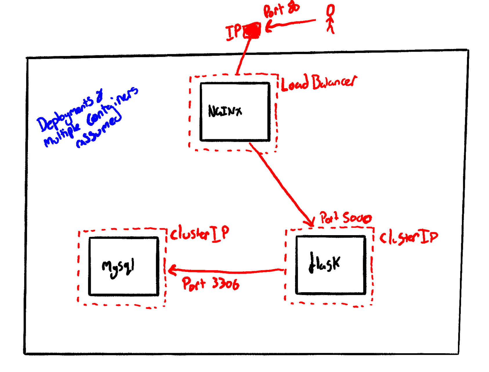

# trio

This is a Flask application that is set up and configured to work with a database and nginx. Write kubernetes manifests that will bring all these services up and allow the app to run on port 80.

Build docker images of the flask app and mysql (the dockerfiles have been provided) and push to your dockerhub

You can also use my images as a back up:

stratcastor/mea21flaskapp:latest

stratcastor/mea21sql:latest

Write kubernetes manifests to deploy nginx containers using proxy pass to communicate with the flask app, nginx should use a LoadBalancer for an entrypoint, Flask and SQL should use ClusterIPs. 

The MySQL service MUST be named "mysql"
Other service and container names are up to you

